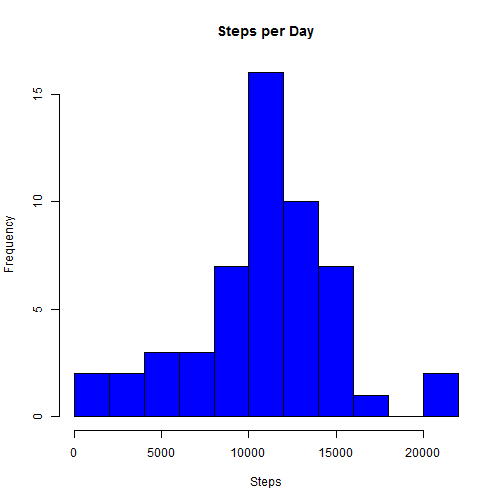
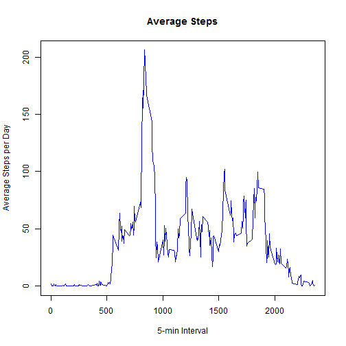
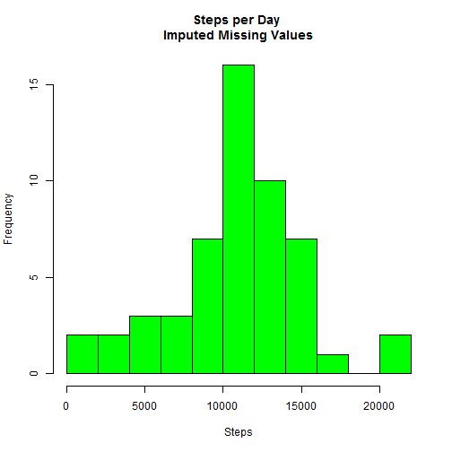

Activity Monitoring
======================
Reproducible Research
Peer Assessment 1

1. Load data, assumes setwd() is already set
2. Transform date into date class


```r
s<-read.csv("activity.csv")
names(s)
```

```
## [1] "steps"    "date"     "interval"
```

```r
s$date<-as.Date(s$date, "%Y-%m-%d")
```
3. Calculate steps per day, with aggregate
4. Histogram of steps
5. mean and median of steps


```r
day<-aggregate(steps ~ date, data = s, sum, na.rm=TRUE)
hist(day$steps, col="blue", main="Steps per Day", xlab="Steps", breaks=10)
```

 

```r
me<-mean(day$steps)
med<-median(day$steps)
print(me)
```

```
## [1] 10766.19
```

```r
print(med)
```

```
## [1] 10765
```
mean steps per day: 1.0766189 &times; 10<sup>4</sup>  
median steps per day: 10765

6. Time series with plot of average steps per 5-minute interval


```r
t<-aggregate(steps ~ interval, data=s, mean, na.rm=TRUE)
plot(t$interval, t$steps, type="l", xlab="5-min Interval", main="Average Steps",  ylab="Average Steps per Day", col="blue")
```

 

7. 5-minute interval with maximum average steps


```r
m<-which.max(t$steps)
m1<-t[m,1]
m2<-t[m,2]
t[m,]
```

```
##     interval    steps
## 104      835 206.1698
```
Interval 835 has maximum number of average steps 206.1698113.

#Imputing Missing Values
1. number of missing values


```r
bad<-is.na(s)
b<-sum(bad)
b
```

```
## [1] 2304
```
There are 2304 missing values in the data set

2. Fill in missing values in dataset with average for that time interval


```r
s2<-s
l<-length(s2$steps)
for(i in 1:l){
  if(is.na(s2[i,1]))
    s2[i,1]<-t[(t$interval == s2[i,3]),2]
  
  }
day2<-aggregate(steps ~ date, data=s2, sum, na.rm=TRUE)
me2<-mean(day2$steps)
med2<-median(day2$steps)
print(me2)
```

```
## [1] 10766.19
```

```r
print(med2)
```

```
## [1] 10766.19
```

```r
hist(day$steps, col="green", main="Steps per Day \nImputed Missing Values", xlab="Steps", breaks=10)
```

 

```r
dm = me2 - me
dmed = med2 - med
```

mean steps per day, with imputed missing values: 1.0766189 &times; 10<sup>4</sup>  
difference of steps in mean from actual value: 0   
median steps per day, with imputed missing values: 1.0766189 &times; 10<sup>4</sup>  
difference of steps in median from actual value: 1.1886792  

- The mean value is not affected but the median has a slight difference.

#Activity on weekdays vs. weekend
1. create column with weekday or weekend to identify day
2. lattice plot results of average 5-minute interval to compare activity


```r
days<-weekdays(s2$date)
wday<-weekdays(s2$date)
for(i in 1:l){
  if(days[i] == "Saturday")
    wday[i] <- "Weekend"
  else if(days[i] == "Sunday")
    wday[i] <- "Weekend"
  else
    wday[i] <- "Weekday"
  }

s2$wday<-factor(wday)

t2<-aggregate(steps ~ interval + wday, data=s2, mean)
library(lattice)
library(grid)
xyplot(steps ~ interval | wday, data=t2, layout=c(1,2), type="l")
```

 


